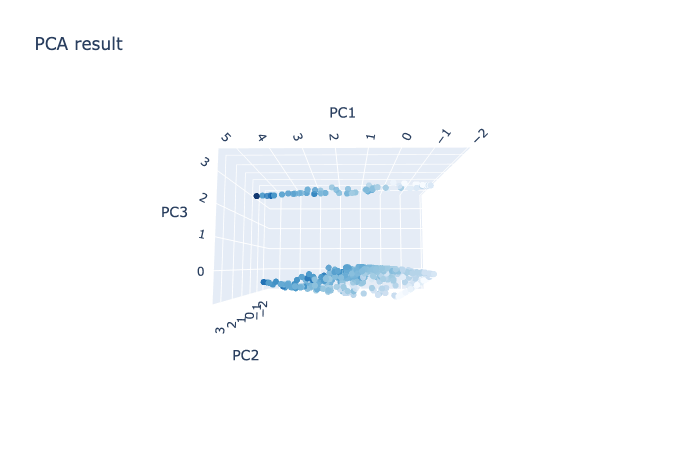
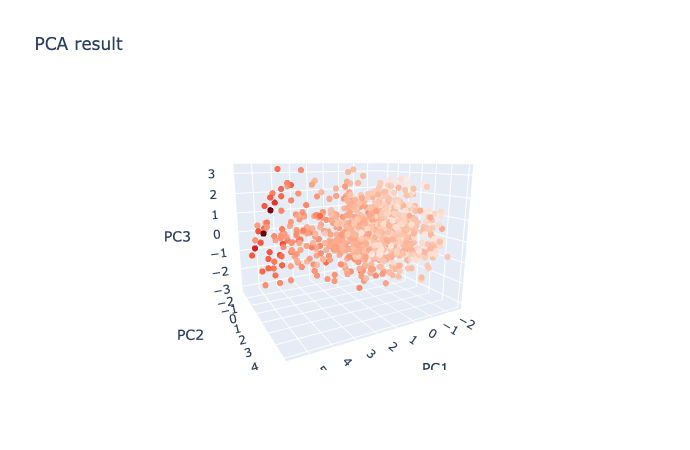

[](http://quantlet.de/)

## [](http://quantlet.de/) **3DPCASeller&Consumer** [](http://quantlet.de/)

```yaml

Name of QuantLet : '3DPCASeller&Consumer'

Published in : 'CSBD Project' 

Description : 'the 3D plotly result of PCA for Seller and Consumer'

Keywords : 'PCA, plotly'

Author : 'WK Haerdle Zuo Xiaorui'

Submitted : Fri, Jan 10 2024
```





### [IPYNB Code: 3DPCASeller&Consumer.ipynb](3DPCASeller&Consumer.ipynb)


automatically created on 2024-01-11