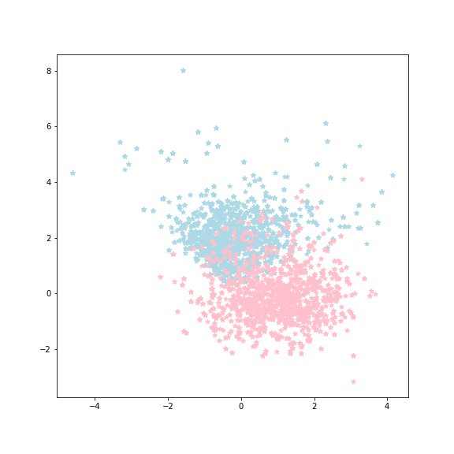

[](http://quantlet.de/)

## [](http://quantlet.de/) **CCA** [](http://quantlet.de/)

```yaml

Name of QuantLet : 'CCA'

Published in : 'CSBD Project' 

Description : 'The process of aligning dimension of Consumer and Seller behavior'

Keywords : 'CSBD, CCA'

Author : 'WK Haerdle Zuo Xiaorui'

Submitted : Tue, Dec 12 2023

```



### [IPYNB Code: CCA.ipynb](CCA.ipynb)


automatically created on 2023-12-12