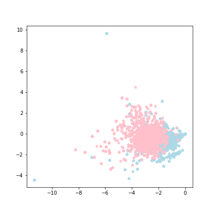
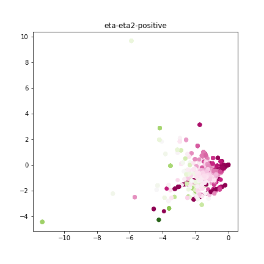
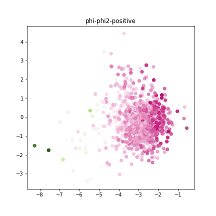

[](http://quantlet.de/)

## [](http://quantlet.de/) **CCA20** [](http://quantlet.de/)

```yaml

Name of QuantLet : 'CCA20'

Published in : 'CSBD Project' 

Description : 'The process of regression of CCA with 20 variables'

Keywords : 'CCA, visualize'

Author : 'WK Haerdle Zuo Xiaorui'

Submitted : Mon, Jan 1 2024
```







### [IPYNB Code: CCA20.ipynb](CCA20.ipynb)


automatically created on 2024-01-01