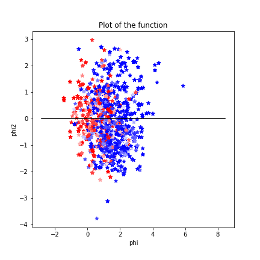

[](http://quantlet.de/)

## [](http://quantlet.de/) **EmoVisual** [](http://quantlet.de/)

```yaml

Name of QuantLet : 'EmoVisual'

Published in : 'CSBD Project' 

Description : 'The process of visualizing emotion positive'

Keywords : 'plot, sentiment, visualize'

Author : 'WK Haerdle Zuo Xiaorui'

Submitted : Sun, Dec 31 2023
```





### [IPYNB Code: EmoVisual.ipynb](EmoVisual.ipynb)


automatically created on 2023-12-31