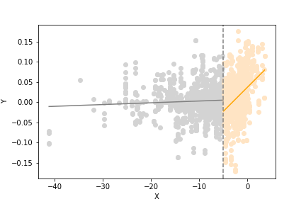
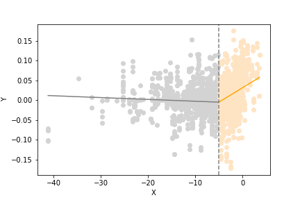

[](http://quantlet.de/)

## [](http://quantlet.de/) **Regression** [](http://quantlet.de/)

```yaml

Name of QuantLet : 'Regression'

Published in : 'CSBD Project' 

Description : 'The process of regression of CSBD-return'

Keywords : 'kinked regression, breakpoint regression'

Author : 'WK Haerdle Zuo Xiaorui'

Submitted : Fri, Dec 29 2023
```





### [IPYNB Code: Regression.ipynb](Regression.ipynb)


automatically created on 2023-12-30